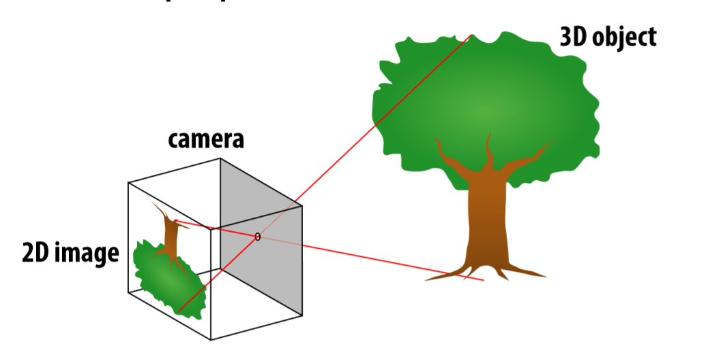

# 01_Course_Intro

**Perspective projection**

- Objects look smaller as they get further away("perspective")

- 其原理为("pinhole") model.(小孔成像)

- where exactly does a point p = (x,y,z) end up on the image ? 考虑如下侧视图
- 

- then v/1 = y/z,  likewise, horizontal coordinate is u = x/z

