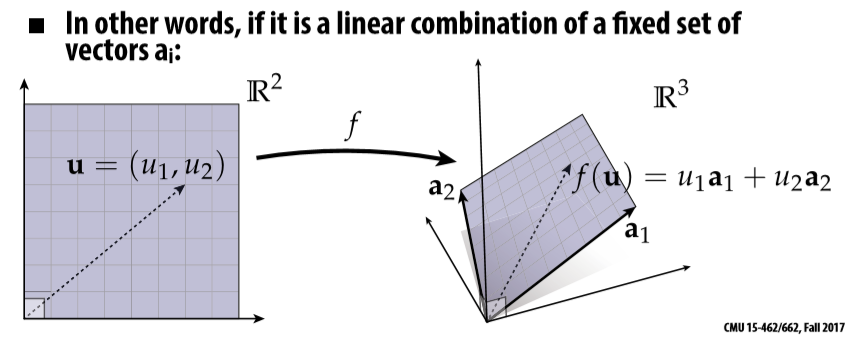
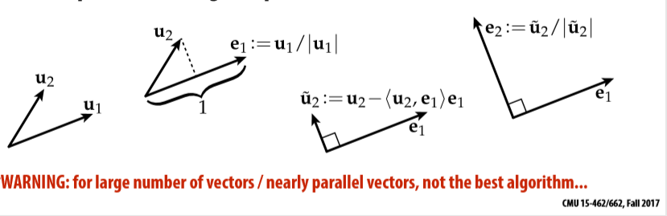

# 02_Linear_Algebra

**Linear Map**

- A map f is linear if it maps vectors to vectors, and if for all vectors u,v and scalars A we have:
  $$
  f(u+v) = f(u)+f(v)\\
  f(au) = af(u)
  $$
  (不仅仅是向量满足该运算，如果函数满足上述条件也称为线性运算)

**Linear Map in Coordinates**

- A Map is linear if it can be expressed as

$$
f(u_{1},...u_{m}) = \sum_{i=1}^n u_i a_i
$$

- 图像表示一个已经存在的Vector线性组合可以由新的向量集合表示

  

**Affine Maps**

- Affine is not a linear, eg. f(x) = ax + b

**span**

- the span is the set of all vectors that can be written as a linear combination of u and v.  show blow:
  $$
  au+bv\\
  span(u1,...,uk) = \lbrace x\subset|x=\sum_{i=1}^k a_iu_i, a_1,...a_k\subset R \rbrace
  $$

**Orthonormal Basis**

- if e1,...,en are our basis vectors then:
  $$
  <e_i,e_j> = \begin{cases}
  	1, i=j\\
  	0, otherwise\\
   \end{cases}
  $$
  即<ei,ej>表示ei在ej上的投影

**Gram-schmidt**

- normalize the first vector(divide by its length)
- subtract any component of the 1st vector from the 2nd one
  - 即将任何vector1在vector2上的分量减去

- normalize the 2nd one
- 经过以上步骤得到两个正交的向量

